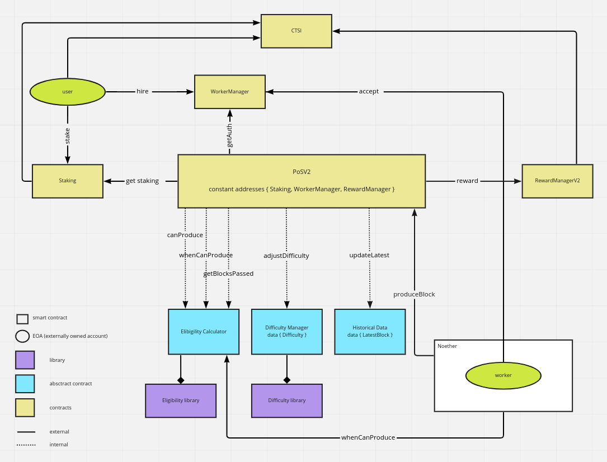

# PoS DLib - Proof of Stake DLib Version 2.0

This repository will hold the main components to choose a random participant based on Proof of Stake, meaning that the probability to be chosen at random is proportional to the amount of tokens staked by the participant. It's a upgraded version from [Cartesi PoS 1.0](https://github.com/cartesi/pos-dlib/tree/v1.1.2), introducing new features, better modularized design, more efficient gas cost and 100% backward compatibility to PoS 1.0.

The dlib can be used under two modes: V1 compatible mode and V2 mode. This document covers the usage of V1 compatible mode.

Here is the overview diagram of V1 compatible mode:

<p align="center"></p>

# Selection process

Before introducing the method, let us lay down some notation and introduction.

For the first implementation we are using the hash of a future block as a source of randomness.
This has a disadvantage by allowing a miner of the main chain to influence the result of this toss, but this is clearly a minor effect as we are not using this for large rewards that would be comparable with those of the main-chain mining.
Also the retossing has a minor effect in the system, unlike cassino-style contracts.

The random selection process will be based on the following algorithm.
After the hash `H` of the block is available for random number generation, each participant in the Proof of Stake algorithm will be able to calculate (off-chain) a random time after which it will be able to claim to be the chosen one.
The first user to call such claim function is the one officially selected.
These random times being different for each user mitigates the problem of race conditions.

- We denote by `T_i` the time interval (counting from the last selection) after which the user `i` can claim to be the winner.
- We write `a_i` and `b_i` for the address and balance of user `i` respectively
- Let `H` denote the hash which will be used as source of randomness
- Let `Y_i = hash(a_i, H)`, which will be a random number specific to user `i`
- Finally we have a variable `difficulty` (which changes addaptively) and regulates the time between selections.

The main formula we use for regulating the system is the one determining `T_i`:


Therefore, before allowing a user to claim to be the selected one, we should run:

```
require(b_i * blockDuration > difficulty * (256 - log(Y_i))
```
where `blockDuration` is the number of blocks since the last person was selected

Note that we should multiply both sides of the above inequality by a large number (say one million) in order to avoid rounding errors (effectively simulating fixed point arithmetics).

It is not hard to see that `T_i` defined above has an exponential distribution with parameter `b_i/difficulty`.
More precisely


Observing that the `T_i`'s are independent of one another, their minimum `T = min{T_i}` is also an exponential random variable with parameter given by `b/difficulty`, where `b` is the total balance of all active stakers `b = sum(b_1, b_2...)`.
This means that the average time for a block to appear is given by `difficulty/b`, so in other words, everytime the actively staked balance of all users change by a factor, the difficulty has to adapt by the same amount in order to regulate the expected interval between selections.

# Staking

In order for tokens to increase the chance of a user being selected they have to be staked. That interaction is done through the `StakingImpl.sol` contract, which offers four main functions:

- `stake(uint256 _amount)`, where a user can deposit CTSI tokens for them to be staked. When new tokens get deposited or `staked` they are subject to the `timeToStake` delay.

- `unstake(uint256 _amount)`, where a user can decide to remove their tokens from the staked balance in order to withdraw them. The tokens unstaked are also, for security reasons, subject to a maturation period before withdrawal is allowed. Unstaked tokens are instantly removed from staked balance, even if theyre still stored inside the Staking contract. When unstaking, the priority is removing first the tokens stored in the `maturing mapping` and then removing the remaining tokens from the `staked balance`.

- `withdraw(uint256 _amount)`, to move tokens from the `releasing mapping` to the `msg.sender` account, if the tokens were in the `releasing mapping` for at least `timeToRelease` seconds.

- `getStakedBalance(address _userAddress)` returns the sum of tokens inside the `staking mapping` plus the tokens inside the `maturing mapping` (if those tokens have been there for more than `timeToStake`seconds).

## Unintuitive behaviour:

Tokens deposited will count as a staked balance after a maturation time. The function `stake(uint _amount)` checks if there are mature tokens to be staked. Being the case, it transforms them into staked balance and adds the new tokens to the `maturing mappping`, starting by the tokens already stored and available on the `releasing mapping`. If there are not enough tokens on the `releasing mapping` to cover the `_amount` sent as a parameter then `ERC20.transferFrom` will be called, sending the remaining tokens from `msg.sender` account to the `StakingImpl` contract. The tokens `staked` do not count as `stakedBalance` until they mature. The maturation period is defined when the contract is deployed.
If the last deposit has already matured (and is counted when `getStakedBalance` is called) it gets moved to the "staked bucket". If not, it's maturation gets reset - meaning that the entirety of tokens matured (the old ones plus the new ones) will mature at the same time in `timeToStake` seconds.
The same is true for the `unstake()` function - any tokens waiting to be released will have their deadlines reset if new tokens are added to the "withdraw bucket".
When unstaking the priority are tokens that are in the "maturing bucket" and then the ones in the already staked one. This behaviour was chosen because it is the one most helpful to the users, since their staked tokens might be generating revenue.

# Eligibility

The Eligibility library contract manages the selection of an address every `targetInterval` blocks according to the weighted random selection [described above](#selection-process).

The method `whenCanProduceBlock` calculates when the user address is eligible to produce a block.

The functionality of the library is inherited by PoSV2Impl contract through `EligibilityCalImpl.sol`

# Difficulty

The Difficulty library contract manages the difficulty adjustment after every block production.

The new difficulty is defined by the `getNewDifficulty` method, which takes into account the difference between the target interval and the actual interval and adjusts the difficulty based on the `adjustmentParam`.

The functionality of the library is inherited by PoSV2Impl contract through `DifficultyManagerImpl.sol`

# RewardManagerV2

Users that get selected by the `Eligibility.sol` contract, which implements the aforementioned selection process, are rewarded by the RewardManager contract. This contract is responsible for transferring the prize in CTSI to the selected address - which is informed by the PoS main contract.

The reward is fixed at 2900.0 CTSI per block production.

# PoSV2

The PoSV2 contract is the main concern when dealing with the Noether architecture, it manages the interactions between the Staking and RewardManagerV2. It is responsible for making sure permissioned calls are secure, instantiating and guiding the RewardManagerV2 on whom to transfer money to. It is also the main concern and the contract that will interact with the offchain part of this dlib.

The contract instantiates a `RewardManagerV2Impl` contract to manage the transfer of rewards.

The worker, representing a user, will constantly check off-chain if the address they are representing has been selected and, if so, they'll call the `produceBlock()` function of PoSV2 on their behalf.
The `produceBlock()` checks if the `msg.sender` is an authorized representant of the selected address and, if they are, rewards the owner of that worker according to the `rewardManager` current reward definition.

The PoSV2 can work under two modes: V1 compatible mode and V2 mode, which is defined by `version` state when the contract is deployed by the `PoSV2FactoryImpl.sol`.

Some useful functions that PoSV2 has to offer

- `produceBlock(uint256)`, the `uint256` parameter has no real use in the method but only to maintain the same signature as PoS 1.0. This call produces a new block if the user is eligible to and represented by the `msg.sender` who is authorized for the interaction.

- `whenCanProduceBlock(address _user)`, returns a mainchain block number when the `_user` is eligible to produce a block. `UINT256_MAX` is returned when the block selection process is not ready or `_user` has zero stake.

- `canProduceBlock(address _user)`, a convinient method that checks if the current mainchain block number has passed the value returned by `whenCanProduceBlock`. Returns `true` if the `_user` can produce a block immediately.

- `getEthBlockStamp()`, returns the mainchain block number of last block production.

- `getLastProducer()` returns the user address of last block production.

- `getSidechainBlockCount()`, returns the number of total blocks have been produced.

# Contributing

Thank you for your interest in Cartesi! Head over to our [Contributing Guidelines](CONTRIBUTING.md) for instructions on how to sign our Contributors Agreement and get started with
Cartesi!

Please note we have a [Code of Conduct](CODE_OF_CONDUCT.md), please follow it in all your interactions with the project.

# Authors

* *Felipe Argento*
* *Danilo Tuler*
* *Stephen Chen*

# License

The repository and all contributions are licensed under
[APACHE 2.0](https://www.apache.org/licenses/LICENSE-2.0). Please review our [LICENSE](LICENSE) file.
